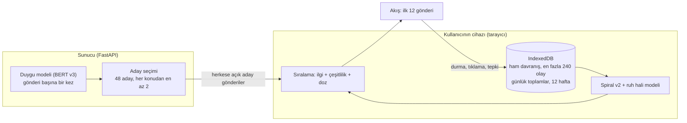
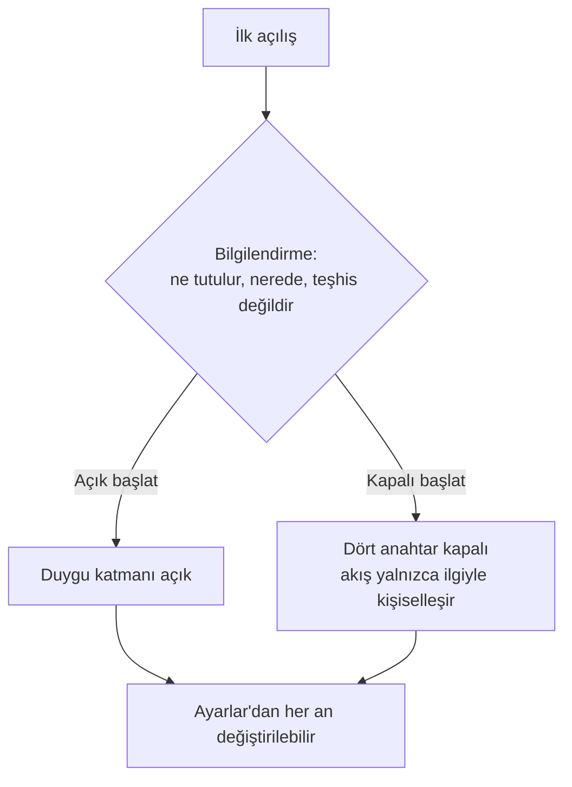
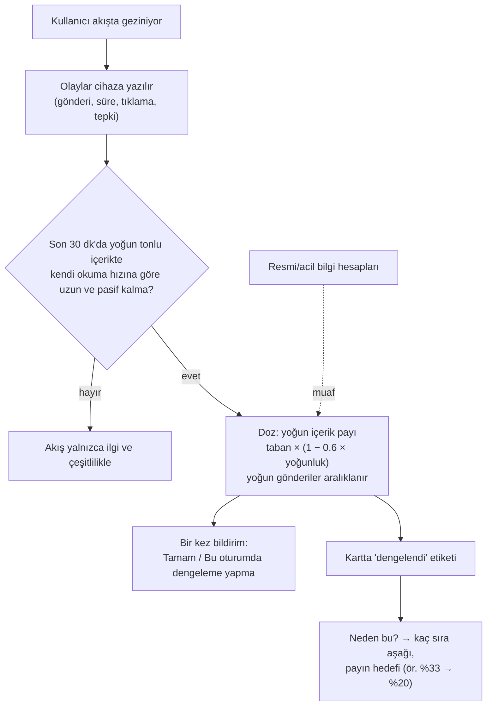
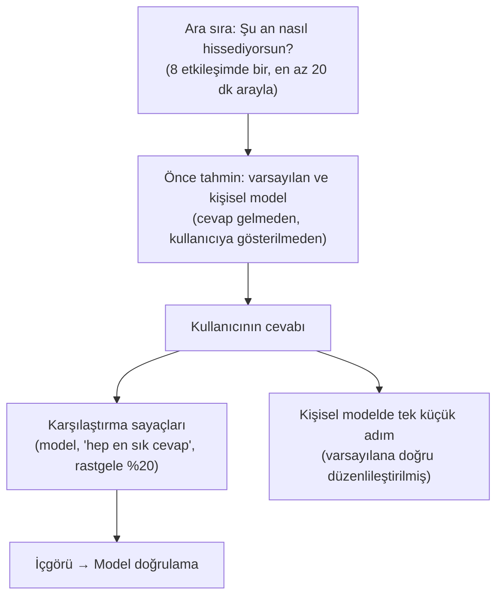

# Kullanıcı Akışları ve Veri Sınırı

## Mimari: neyin nerede işlendiği

Sunucu davranış verisi kabul eden hiçbir uç nokta sunmaz; bu bir tarayıcı
testiyle ve `demo_kontrol.py` ile doğrulanır.

## 1. İlk açılış ve açık rıza

Seçim ve tarihi yalnızca cihazda saklanır; Ayarlar → "Verilerin" bölümünde
görünür.

## 2. Akış, dengeleme ve açıklama

## 3. Kontrol sorusu ve cihazda öğrenme

Kişisel model yalnızca tahmin etiketlerini etkiler; akışın sıralamasını
kullanıcı başına kaydırmaz.

## 4. Kontrol ve silme

- **Ayarlar:** duygu dengeleme, renkleri yumuşatma, kontrol soruları, kişisel
  uyarlama (her biri ayrı anahtar).
- **Tüm yerel verileri sil:** olaylar, profil, günlük özetler ve kişisel model
  silinir; ayar seçimleri korunur. İki adımlı onay.

## 5. Yedek yol: tarayıcı yerel depolamaya izin vermiyorsa

Akış açılır ama kişiselleştirilmez; durum kartı "Kişiselleştirme kapalı" der ve
hiçbir davranış verisi gönderilmez (tarayıcı testiyle doğrulanır).

## 6. Jüri demosu

Hazır 12 aday ve 10 örnek sinyal cihazda, gerçek sıralama fonksiyonlarıyla
işlenir; önce/sonra sıra ve gerekçe `/juri.html`'de saklanır. Dengeleme
Ayarlar'dan kapatılıp demo tekrar çalıştırılırsa yoğun gönderiler aşağı alınmaz.
